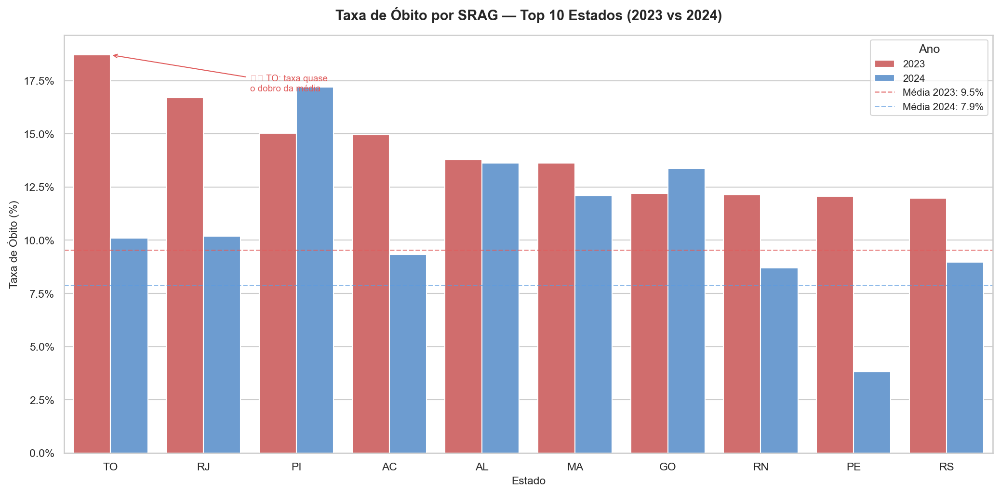

# Projeto SRAG — Pipeline ETL com DuckDB e Medallion Architecture

Pipeline de dados construído para ingerir, limpar e analisar dados públicos da Síndrome Respiratória Aguda Grave (SRAG), disponibilizados pelo OpenDataSUS, aplicando conceitos de Engenharia de Dados e Analytics Engineering.



---

## 📌 Visão Geral

O projeto realiza a extração, transformação e organização de dados de SRAG (2023 e 2024) em uma estrutura analítica, permitindo explorar indicadores de mortalidade, internações em UTI, uso de suporte ventilatório e perfil clínico dos pacientes.

**Objetivo**
- Construir um pipeline de dados reproduzível usando Python e DuckDB
- Aplicar boas práticas de transformação e padronização de dados
- Gerar uma camada analítica pronta para consumo em dashboards e análises
- Responder a perguntas relevantes para a saúde pública e a gestão hospitalar

**Tecnologias**
`Python` · `DuckDB` · `Pandas` · `Parquet` · `Seaborn/Matplotlib` · `Git/GitHub`

---

## 🏗️ Arquitetura

O projeto segue a **Medallion Architecture** (Bronze → Silver → Gold), padrão utilizado por empresas como iFood, Nubank e Itaú em seus Data Lakes.

```
CSV bruto (547 mil registros)
        ↓
   01 - Bronze
   Dado original preservado
        ↓
   02 - Silver
   Dado limpo e confiável
        ↓
   03 - Gold
   Perguntas respondidas
```

| Camada | Conteúdo |
|---|---|
| **Bronze** | Dados brutos extraídos do OpenDataSUS, sem nenhuma alteração |
| **Silver** | Dados limpos, padronizados, decodificados e tipados corretamente |
| **Gold** | Tabelas analíticas agregadas, prontas para consumo em BI |

---

## 📂 Estrutura do Projeto

```
Projeto_SRAG/
│
├── Data/
│   ├── 01-Bronze/      # CSVs brutos do OpenDataSUS
│   ├── 02-Prata/       # Parquet limpo e padronizado
│   └── 03-Gold/        # Tabelas analíticas agregadas
│
├── Notebook/
│   └── explorar.ipynb  # Exploração e testes com DuckDB
│
├── src/
│   ├── extract.py      # Download automático dos CSVs (Bronze)
│   ├── transform.py    # Limpeza e transformação (Bronze → Silver)
│   ├── saude_publica.py # Análises de saúde pública (Silver → Gold)
│   ├── hospital.py     # Análises hospitalares (Silver → Gold)
│   └── load.py         # Orquestra a geração da Gold
│
├── config.py            # Centraliza caminhos e parâmetros
├── main.py               # Orquestra o pipeline completo
├── requirements.txt
└── README.md
```

---

## ⚙️ Pipeline de Extração

**Fonte dos dados:** [OpenDataSUS](https://opendatasus.saude.gov.br/) — banco de dados de SRAG, anos epidemiológicos de 2023 e 2024 (`INFLUD23`, `INFLUD24`).

O `extract.py` realiza requisições HTTP diretas aos servidores do OpenDataSUS, verifica se os arquivos já existem na camada Bronze antes de baixar (evitando downloads desnecessários) e preserva os CSVs originais sem nenhuma alteração.

---

## 🔄 Pipeline de Transformação

O `transform.py` usa DuckDB para processar os CSVs brutos com alta performance:

- **União dos anos** — 2023 e 2024 combinados via `UNION ALL`, com função reutilizável (`source_query`) para evitar duplicação de lógica
- **Conversão de idade** — decodificação do campo `COD_IDADE` (formato especial do SINAN: tipo + valor) para idade em anos
- **Decodificação de campos** — todos os códigos numéricos (sexo, comorbidades, evolução, classificação) convertidos para texto legível
- **Tratamento de datas** — `TRY_CAST` evita que datas inválidas quebrem o pipeline
- **Padronização de nomes** — colunas renomeadas para `snake_case`

Resultado: **529.964 registros** tratados e salvos em Parquet (compressão ZSTD) na camada Silver.

---

## 📊 Qualidade dos Dados

- Registros sem `COD_IDADE` válido ou sem `CLASSI_FIN` foram descartados na transformação
- Valores de digitação inválidos (ex: `"20-5"` no campo idade) tratados com `TRY_CAST`
- Defesa contra outliers no cálculo de tempo de internação (`dt_evolucao >= dt_internacao`)
- **Aproveitamento:** 529.964 de 547.439 registros brutos (96,8%)

---

## 💡 Perguntas de Negócio e Respostas

### 🏛️ Saúde Pública

**Quais estados tiveram maior taxa de óbito em 2023 vs 2024?**
Tocantins liderou em 2023 com **18,71%** de taxa de óbito — quase o dobro da média nacional (9,15%), apesar do baixo volume de casos (807).

**A situação melhorou ou piorou entre os dois anos?**
Melhorou de forma consistente — a taxa de óbito nacional caiu de **9,15%** em 2023 para **7,98%** em 2024.

**Quais estados sobrecarregaram mais as UTIs?**
Rio de Janeiro liderou com **41,18%** dos casos internados em UTI em 2023.

### 🏥 Hospital

**Qual o perfil de quem foi para UTI?**
Idade média de 33,1 anos (masculino) e 38,0 anos (feminino) em 2023. Cardiopatia é a comorbidade mais frequente.

**Quanto tempo em média ficou internado quem sobreviveu vs quem foi a óbito?**
Quem recebeu alta ficou em média **9,1 dias** internado. Quem evoluiu a óbito ficou em média **13,2 dias** (2023) — quase 4 dias a mais.

**Quais comorbidades mais aparecem em óbitos?**
Cardiopatia lidera com folga (9.438 óbitos em 2023), seguida de diabetes (5.878 em 2023).

---

## 🚀 Como Executar

```bash
# Clona o repositório
git clone https://github.com/OliTomazella/projeto-srag.git
cd projeto-srag

# Instala as dependências
pip install -r requirements.txt

# Roda o pipeline completo (extração + transformação + carga)
python main.py
```

O `main.py` orquestra as três etapas — extração, transformação e carga — medindo o tempo de execução e listando os arquivos gerados na Gold ao final.

---

## 🧠 Aprendizados e Desafios

**Desafios técnicos enfrentados**
- `COD_IDADE` com tipos mistos quebrando a leitura do CSV — resolvido forçando leitura como `VARCHAR` e usando `TRY_CAST`
- Caminhos relativos quebrando entre execuções — resolvido com `__file__` no `config.py` para detectar a raiz do projeto automaticamente

**Decisões técnicas**
- **DuckDB** em vez de pandas puro — processamento colunar mais rápido para 547 mil registros
- **Parquet com compressão ZSTD** em vez de CSV — formato nativo do Azure Data Lake
- **Medallion Architecture** — separa dado bruto de dado confiável de dado pronto para consumo

---

## 🔮 Próximos Passos (Pt. 2)

Pensando no amadurecimento desta solução, os próximos passos mapeados incluem:

**1. Transição de Arquitetura: ETL para ELT**
Extração e carregamento dos dados em estado bruto, postergando a transformação para dentro do ambiente de armazenamento — maior flexibilidade para reprocessamentos.

**2. Implementação do dbt**
Modularização do SQL em modelos reutilizáveis, testes automatizados de qualidade de dados e documentação/data lineage gerados nativamente.

**3. Otimização de Queries com Window Functions**
Uso de `LAG`/`LEAD` para análises temporais período-contra-período e criação de rankings dinâmicos por partição.

**4. Infraestrutura em nuvem**
Pipeline rodando no Azure Data Factory, dados servidos via Azure Synapse para Power BI.

---

## 📁 Fonte dos Dados

Dados públicos disponibilizados pelo [OpenDataSUS](https://opendatasus.saude.gov.br/) — Ministério da Saúde, sob a Lei Geral de Proteção de Dados Pessoais (LGPD).
